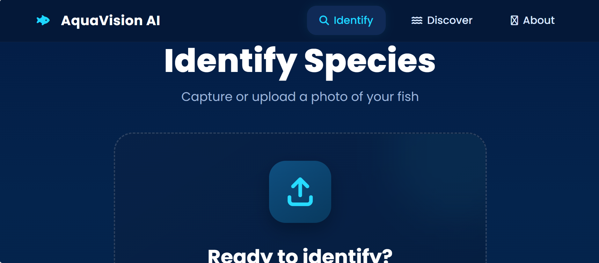

# AquaVision AI

AquaVision AI is an AI-powered aquarium fish classification system designed to automatically identify fish species from images using advanced deep learning and computer vision techniques. By extracting and analyzing key visual features, the platform delivers accurate species predictions through an intuitive and user-friendly interface.

## Key Features
1. Automated aquarium fish species classification
2. Deep learning-based image recognition
3. Image upload and real-time prediction
4. Confidence score visualization
5. Support for multiple fish species
6. Web-based user interface
7. Fast and accurate inference
## Preview

